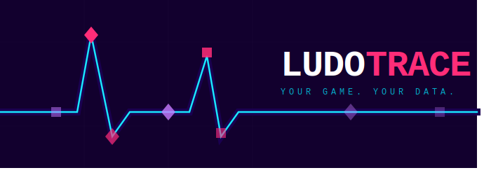

---

LudoTrace captures what actually happens when you play — and makes that data useful.

Every session tells a story. LudoTrace writes it down.

---

## HOW IT WORKS

1. Install the mod for your game
2. Play normally
3. Find your session log in the game folder
4. Do whatever you want with it

The log is plain JSONL — readable by humans, parseable by machines, compatible with any LLM, spreadsheet, or script you already use.

---

## CURRENT MODS

| GAME | STATUS |
|------|--------|
| [Fallout 4](https://github.com/ludotrace/fallout4) | Active |
| [Stardew Valley](https://github.com/ludotrace/stardew) | Active |

---

## THE PATTERN

> Local game state → structured event log → your reasoning layer

The mod is the black box. What you do with the data is up to you. Coach yourself. Roast yourself. Build dashboards. Feed it to an AI. Share it with friends.

---

## CONTRIBUTING

Open source. If you want to build a mod for another game, open an issue or a PR.

---

*Ludus (n.) — Latin. Public games. Play. The thing itself.*
